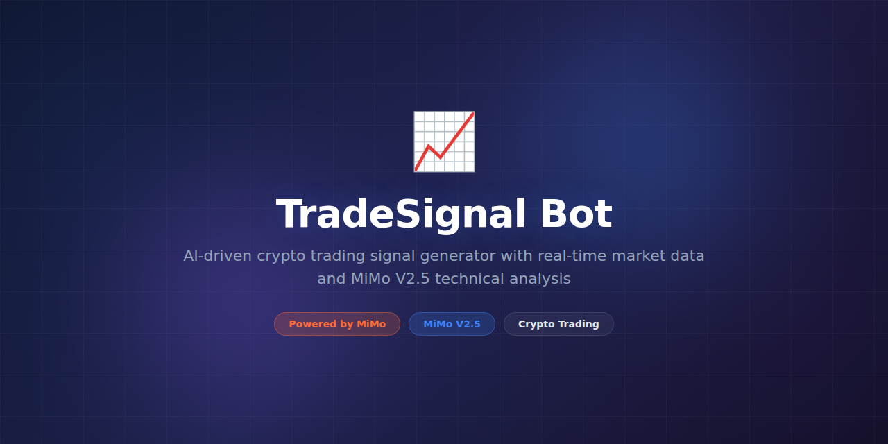

# TradeSignal Bot



> **Powered by MiMo** — built on top of Xiaomi's [MiMo](https://platform.xiaomimimo.com) reasoning models for real-time market analysis and trading signal generation.

[](https://opensource.org/licenses/MIT)
[](https://platform.xiaomimimo.com)
[](https://www.python.org/downloads/)

---

## Why MiMo

Financial markets generate overwhelming amounts of data — price action across multiple timeframes, order book depth, trade flow, news sentiment, macro indicators, social signals, and on-chain metrics for crypto. Traditional quantitative models excel at statistical pattern matching but struggle with contextual reasoning: understanding *why* a pattern matters given current market conditions, regulatory changes, or macroeconomic shifts.

MiMo V2.5 provides the reasoning backbone that pure quantitative models lack. It can synthesize disparate data streams, weigh conflicting signals, and produce nuanced assessments that account for market regime changes, geopolitical events, and sentiment shifts. This contextual judgment separates profitable signals from noise — the difference between a model that backtests well and one that performs in live markets.

The model's chain-of-thought reasoning also produces transparent explanations for every signal. Traders can review the reasoning, understand the thesis, and make informed decisions rather than blindly following black-box outputs. This transparency is essential for building confidence and maintaining discipline in live trading.

## Token consumption

| Agent | Model | Tokens/run | Frequency | Daily/user |
|---|---|---|---|---|
| Market Analyzer | MiMo V2.5 | ~5,400 | Every 15min | ~518,400 |
| Signal Generator | MiMo V2.5 | ~2,800 | Per signal | ~56,000 |
| News Interpreter | MiMo V2.5 | ~3,200 | Per article | ~96,000 |
| **Total** | | **~11,400** | | **~670,400** |

> High token usage reflects continuous 24/7 market monitoring. Use `--interval 1h` for lower consumption.

## What it does

TradeSignal Bot monitors cryptocurrency and equity markets in real time, combining technical indicators, order book data, and news sentiment with MiMo-powered reasoning to generate actionable trading signals. Each signal includes a confidence score, entry/exit targets, stop-loss levels, and a full rationale explanation.

## Why this exists

Retail traders lack access to the sophisticated AI-driven analysis tools used by institutional desks. Existing signal services are either black boxes with no transparency or simple indicator alerts with no contextual reasoning. TradeSignal Bot democratizes intelligent market analysis with explainable, reasoning-driven signals that traders can understand and evaluate.

## Features

- Multi-exchange data aggregation (Binance, Coinbase, Kraken, Bybit)
- Technical analysis with 30+ indicators (RSI, MACD, Bollinger, VWAP, etc.)
- Real-time news and social sentiment integration
- MiMo-powered contextual signal reasoning
- Confidence scoring with full rationale and thesis
- Telegram and Discord alert delivery with rich formatting
- Backtesting framework with historical performance tracking
- Portfolio risk assessment per signal
- Multi-timeframe analysis (1m to 1W)
- Custom strategy configuration via YAML

## Tech Stack

- **Runtime:** Python 3.11+
- **AI Engine:** MiMo V2.5 via Xiaomi Platform API
- **Market Data:** ccxt, yfinance, WebSocket feeds
- **News:** NewsAPI, Twitter/X API, RSS aggregation
- **Storage:** TimescaleDB, Redis (real-time cache)
- **Messaging:** python-telegram-bot, discord.py
- **Charts:** matplotlib, plotly (signal visualization)
- **Infra:** Docker, Kubernetes (production)

## Quickstart

```bash
# Clone and install
git clone https://github.com/your-org/TradeSignal-Bot.git
cd TradeSignal-Bot
pip install -e ".[dev]"

# Configure
cp .env.example .env
# Set MIMO_API_KEY, EXCHANGE_KEYS, TELEGRAM_TOKEN in .env

# Run a single analysis
python -m tradesignal analyze BTC/USDT

# Analyze with custom timeframe
python -m tradesignal analyze ETH/USDT --timeframe 4h --depth 100

# Start the live signal bot
python -m tradesignal run --interval 15m

# Run backtesting
python -m tradesignal backtest --strategy momentum --from 2024-01-01 --to 2024-12-31

# Run via Docker
docker compose up -d
```

## Project Structure

```
TradeSignal-Bot/
├── assets/
│   └── banner.png
├── tradesignal/
│   ├── __init__.py
│   ├── bot.py              # Main bot orchestrator
│   ├── analyzer.py         # MiMo market analysis engine
│   ├── indicators.py       # Technical indicator calculations
│   ├── sentiment.py        # News/social sentiment pipeline
│   ├── signals.py          # Signal generation & scoring
│   ├── backtest.py         # Historical backtesting framework
│   ├── alerts.py           # Telegram/Discord delivery
│   ├── exchanges.py        # Exchange API wrappers
│   └── strategies/         # Configurable strategy modules
│       ├── momentum.yaml
│       └── mean_reversion.yaml
├── tests/
│   ├── test_indicators.py
│   ├── test_signals.py
│   └── fixtures/
├── docker-compose.yml
├── .env.example
├── Dockerfile
├── pyproject.toml
└── README.md
```

## Contributing

See [CONTRIBUTING.md](CONTRIBUTING.md) for guidelines. We welcome new exchange integrations, indicator implementations, and strategy templates.

## Configuration

Customize strategies and alert delivery:

```yaml
# strategies/momentum.yaml
strategy:
  name: "momentum"
  timeframes: ["15m", "1h", "4h"]
  indicators:
    rsi: { period: 14, oversold: 30, overbought: 70 }
    macd: { fast: 12, slow: 26, signal: 9 }
    ema: { periods: [20, 50, 200] }

alerts:
  telegram:
    enabled: true
    min_confidence: 0.7
  discord:
    enabled: false

risk:
  max_position_size: "5%"
  stop_loss_default: "2%"
  take_profit_ratio: 3
```

## License

MIT License — see [LICENSE](LICENSE) for details.

---

*Built with ❤️ using MiMo reasoning models.*
